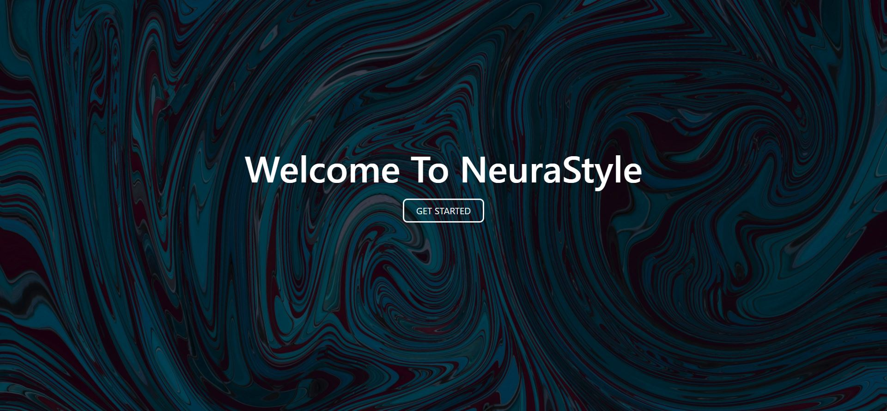
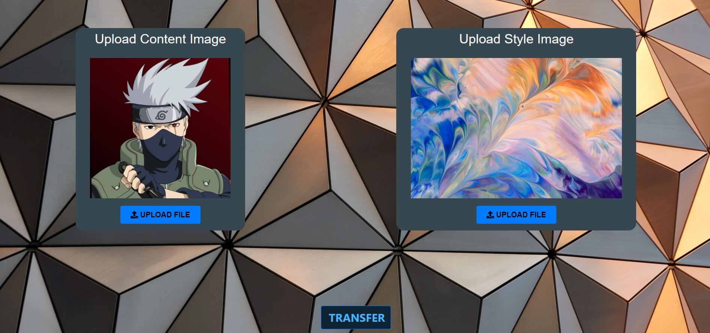
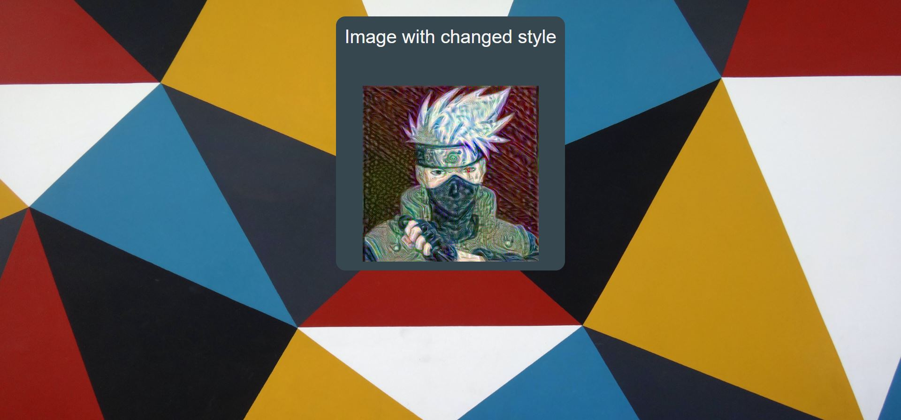

# NeuralStyleTransfer
The objective of this application is to transfer the style of one image to the other.
The image from which the style is to be transferred is called 'Style Image' and the image to which style is to be applied is calle 'Content Image'
This is an implementaion inspired the orignal Neural Style Transfer (Link: https://arxiv.org/abs/1508.06576)
## Application in action
> ### LANDING PAGE

> ### IMAGE UPLOAD PAGE

> ### IMAGE TRANSFER PAGE



## Tech Stack
* The frontend was made using react with typescript(Although I quickly realized it was an overkill)
* The backend is made using flask

## Additional info before starting

The NSTmodel.py (in Server directory) is a custom model I made, implementing the neural style algorithm which you can read in the link provided above.
Due to the nature of the algorithm, the model cannot be pre-trained (although it a pretrained VGG19 model as a subrouting) as the weights to be updated are the pixels of the
'Content Image' itself, which changes if user changes the 'Content Image'.
> ### **NOTE:** The process of transferring is computationally expensive, so it is recommended to run it on a machine with a GPU which supports CUDA(api for parallel computing  by Nvidia) and have appropriate version of CUDA Toolkit(in this case V11.0) and corresponding cuDNN(for CUDA V11.0) installed on your machine. In case your machine doesn't have a supporting GPU, change the variables in NSTmodel.py as follows
```
self.epochs = 1
self.steps_per_epochs = 2
```

## Setting up the application's development environment on your local machine
#####(The path changes are relative to root)
### Installing client side dependancies
```
cd client
npm install
```
### Installing server side dependancies
> Installing node modules
```
cd Server
npm install
```
> Installing python  dependancies
```
cd Server
.\env\Scripts\activate 
pip install -r requirements.txt
```

### Running the application
```
npm run dev
```
